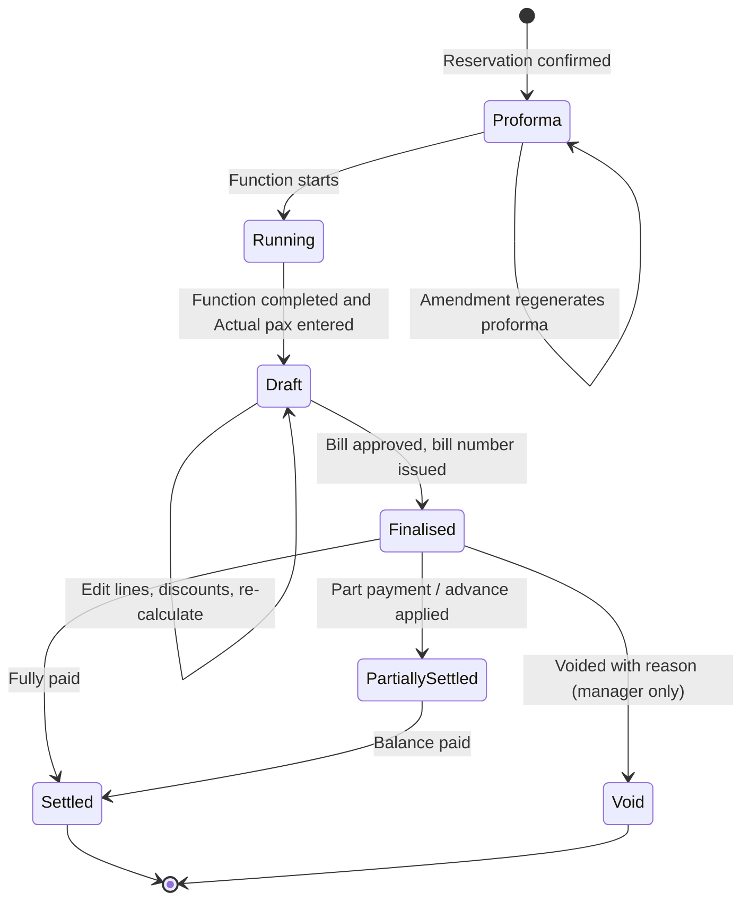
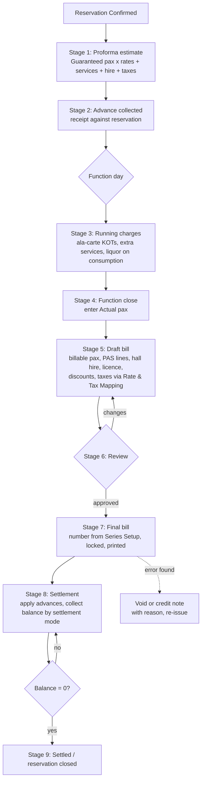

# Banquet Billing Stages

Fills the empty **"Banquet Billing Stages"** section of the BanquetFlow requirements document.

Items marked **[Proposed default]** are not in the original document and should be confirmed.

## 1. What goes on a banquet bill

A banquet bill is a mix of the **PAS** components plus two India-specific extras named in the document.

| Component | Source | Quantity | Rate |
|---|---|---|---|
| **Package** | Package lines on the reservation | Billable pax = max(Guaranteed, Actual) per line (see [guest-count-rules.md](guest-count-rules.md)) | Package rate agreed on the reservation |
| **Ala-carte** | POS orders (KOTs) posted to the reservation, or pre-booked ala-carte items | Actual quantity ordered | Item rate from Menu Management, or a rate agreed on the reservation |
| **Services** | Service lines (dance floor, projector, décor), often from a Vendor | Quantity on the line | Agreed rate |
| **Hall hire** | **[Proposed]** A fixed charge per hall per booking, or per hour | 1 or hours | Rate from Rate & Tax Mapping or agreed |
| **Liquor licence** | **[Proposed]** A fixed charge per booking when liquor is served | 1 | Rate from Rate & Tax Mapping or agreed |

Every line carries its **A-Type** (Package / Ala-carte / Services) and **Income / Expense Head**, so revenue can be reported by head.

## 2. Bill status diagram

## 3. End-to-end flow

## 4. Stages in detail

### Stage 1 — Proforma estimate

- Generated when a reservation is **Confirmed** (and optionally at Provisional, for quoting).
- Uses **Guaranteed pax** for package lines, pre-booked ala-carte at agreed quantities, services, hall hire and licence, plus taxes.
- Printable and emailable as a quotation. Not a tax invoice and carries no bill number.
- Regenerated on every amendment. Earlier versions are kept with the reservation revision they belong to.

### Stage 2 — Advance collection

- Advances are recorded as **receipts** against the reservation, with a receipt number from Series Setup and a settlement mode (cash, card, UPI, bank transfer, cheque).
- The required advance is calculated from the proforma. See [open-questions.md](open-questions.md#1-advances-and-deposits) for the proposed policy.

### Stage 3 — Running charges (In Function)

- Ala-carte orders punched in POS against the reservation post here as they happen. This is how liquor on actual consumption is billed.
- Extra services added on the day post here.
- **[Proposed]** The banquet captain can see the running total at any time.

### Stage 4 — Function close

- The reservation moves to **Function Completed** and **Actual pax** is entered per package line.
- Billable pax is calculated (max of Guaranteed and Actual per line).

### Stage 5 — Draft bill

The system builds the draft bill in this order:

1. **Package lines:** billable pax × package rate.
2. **Ala-carte lines:** quantities from running charges and pre-booked items.
3. **Service lines.**
4. **Hall hire and liquor licence**, if applicable.
5. **Discounts** (**[Proposed]** per line or on the bill total, as % or amount; each needs a reason and a role permission above a set limit).
6. **Taxes** per line, using Rate & Tax Mapping and the Tax Master entries valid on the **function date**. Fixed-rate taxes are added as amounts; percentage taxes on the line's taxable value.
7. **Tax-inclusive packages** are back-calculated. See [open-questions.md](open-questions.md#4-tax-inclusive-packages).
8. **Rounding:** each line to 2 decimals; **[Proposed]** the bill total rounded to the nearest whole currency unit, with a separate "round-off" line.

The draft can be edited, recalculated and printed as a "DRAFT" any number of times.

### Stage 6 — Review

- **[Proposed]** A user with the "approve bill" permission checks the draft against the Event Order and Billing Instructions.
- Sent back to draft for changes, or approved.

### Stage 7 — Final bill

- Gets the next **bill number** from Series Setup (per property, **[Proposed]** per financial year).
- Becomes **locked**. No line, quantity, rate or tax can change.
- Printed using the layout from Print Setup.
- Any later correction is a **void** (manager only, with reason, before any settlement) or a **credit note** against the bill, never an edit.

### Stage 8 — Settlement

- Advances already received are applied first.
- The balance is settled by one or more modes from Settlement Setup (cash, card, UPI, bank transfer, **[Proposed]** credit to a company account / city ledger for corporate clients).
- Partial settlement is allowed; the bill stays **Partially Settled** until the balance is zero.
- If advances exceed the bill, the excess is refunded or kept as a credit, with a receipt.

### Stage 9 — Settled and closed

- Bill status is **Settled** and the reservation moves to **Billed / Closed**.

## 5. Masters this flow depends on

| Master | Used in stage | Status in the original doc |
|---|---|---|
| Menu Management (A-Type, Inc/Exp Head, default rate) | 1, 3, 5 | Described |
| Tax Master | 1, 5 | Described |
| Rate & Tax Mapping / Map Taxes | 1, 5 | **Empty**. Needs to say which taxes apply to which item, A-Type or charge, and any property-specific rates |
| Series Setup | 2, 7 | Listed, not described |
| Settlement Setup | 2, 8 | Listed, not described |
| Print Setup | 1, 7 | Listed, not described |
| Billing Instructions | 6 | Described (single field) |
| Vendor Master | 1, 5 (services) | Described (single field) |
