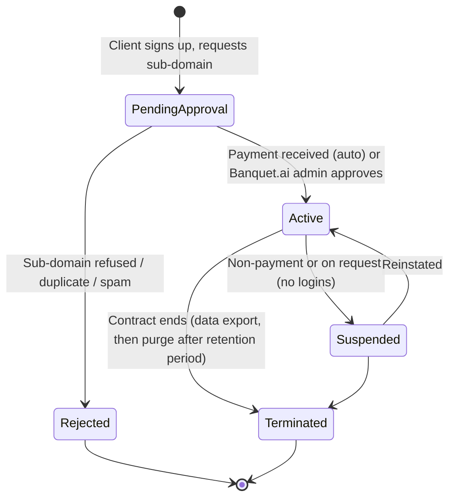
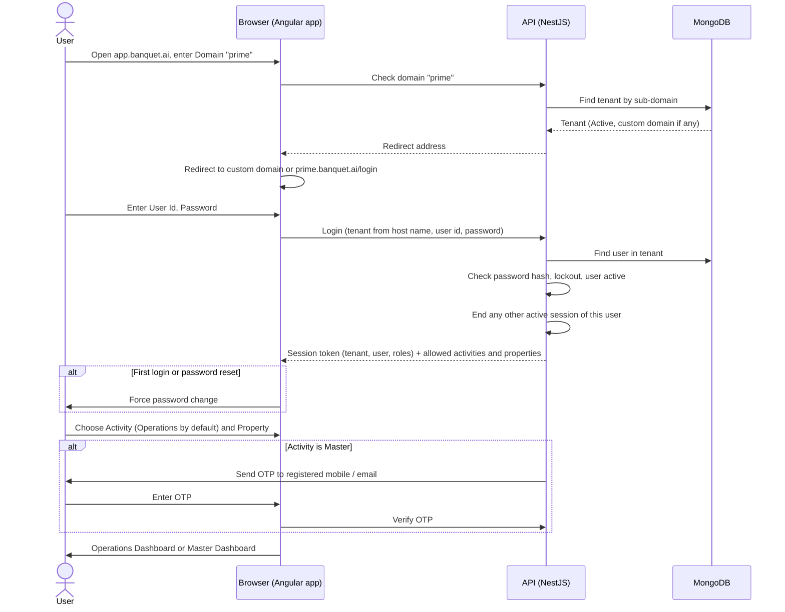

# Client Sign-up, Redirection and Login

Expands the **"Client Redirection and Login Logic"** section of the BanquetFlow requirements document.

What the original document says:

- After sign-up, a short **sub-domain** is reserved for the hotel or banquet group (e.g. `prime` for Hotel Prime Residency).
- Once the sub-domain is approved, a master user **`entp`** (hard-coded user id) is created with an **auto-generated password**.
- `entp` has access to everything (Master + Operations panels). Implementation engineers use it to set the client up.
- Login order: **Domain → User Id → Password → Activity** (Operations Dashboard or Master Dashboard), with **Operations as the default**.

Items marked **[Decided]** were confirmed by Awin Pavan on 2026-10-01. Items marked **[Proposed default]** still need confirming.

## 1. Terms

| Term | Meaning |
|---|---|
| **Tenant** | One client (hotel or banquet group). Owns one sub-domain, optionally its own custom domain, and all its data. |
| **Sub-domain** | The tenant's short code, e.g. `prime`. Used in the URL `prime.banquet.ai` and typed as "Domain" on the login screen. |
| **Custom domain** | The tenant's own web address, e.g. `banquets.primeresidency.com`, pointing at Banquet.ai. |
| **Company / Property** | Inside a tenant: one or more companies, each with one or more properties (from Master Data). |
| **Activity** | Which panel the user opens after login: **Operations** (diary, reservations, billing) or **Master** (setup screens). |

## 2. Tenant lifecycle

### Sign-up

1. Client fills a sign-up form on `banquet.ai`: organisation name, contact name, email, mobile, requested sub-domain, number of properties.
2. **Sub-domain rules [Proposed default]:** 3 to 15 characters, lowercase letters and digits only (no spaces or hyphens), must start with a letter, unique across all tenants. Reserved words are refused: `www`, `app`, `api`, `admin`, `mail`, `support`, `help`, `status`, `docs`, `entp`.
3. The requested sub-domain is held (not usable by anyone else) while it is **Pending Approval**.

### Approval **[Decided]**

Both ways are supported:

- **Automatic on payment.** When the sign-up payment is confirmed by the payment gateway, the tenant is approved with no manual step.
- **Manual by a Banquet.ai admin.** An admin can approve a pending tenant at any time, for example for a trial, a demo, an offline payment or an enterprise contract.

The admin console shows how each tenant was approved (payment reference, or the admin who approved it).

### Banquet.ai admin console **[Built]**

Banquet.ai staff with the **Admin** role see four more pages in the console at `/support` (section 6):

- **Overview:** counts by status and billing, sign-ups waiting for approval, overdue clients, trials ending within a week, and the latest admin actions.
- **Clients:** every tenant, searchable by name, address or contact email, filtered by status and billing. A client's page shows its contact, usage against the plan's limits, and these actions:
  - **Approve** a pending sign-up, optionally with a plan and a free trial (days). The `entp` login is emailed as in "On approval".
  - **Reject** a sign-up, **Suspend** an active client, or **Reactivate** a suspended one. Each needs a reason of at least 5 characters, which the client is emailed. Suspending signs out all its users and ends any support session; data is kept.
  - **Plan and trial:** the plan and the trial end date can be changed at any time.
  - **Record a payment** received outside the gateway (bank transfer, UPI, card, cheque...), with the period it covers. "Paid until" moves to the end of the latest period and never back.
  - **Own domains** (section 3): add a domain, give the client the TXT and CNAME records shown, then press **Check**. The domain is verified once the TXT record `_banquet-verify.<domain>` holds the value shown. A failed check says what was found.
- **Plans:** code, name, currency, monthly and yearly price, maximum properties and users (0 = no limit), and whether it is offered to new clients. Going over a limit is shown on the client's page; nothing is blocked.
- **Staff:** add support staff (Agent, Manager or Admin), change roles, disable them (which ends their sessions), and email a new temporary password. Admins cannot disable or demote themselves.

**Billing status** of an active client: **Paid** while "paid until" is today or later; otherwise **On trial** while the trial runs; **Overdue** once either has passed; **Not paid yet** if there was neither.

Every admin action is logged with who did it and when, and shows in the client's History and on the Overview.

The first admin is created with `POST /api/platform/support-users` and the platform token (role `admin`); after that, admins add staff from the console.

### On approval

1. The tenant becomes **Active**.
2. The **`entp`** user is created inside the tenant with a random password (**[Proposed default]** 16 characters). The credentials go to the client's contact email only, never shown on screen.
3. The Banquet.ai team creates **named implementation users** for the engineers assigned to the client (see section 5).
4. `prime.banquet.ai` starts working (wildcard DNS and SSL certificate cover every sub-domain, so nothing is set up per tenant).

## 3. Custom domains **[Decided]**

A tenant can use its own domain, e.g. `banquets.primeresidency.com`, and this is the preferred way for clients who have one. The `banquet.ai` sub-domain always keeps working as a fallback.

Setup steps (from the Master panel, or by Banquet.ai support):

1. The tenant enters the domain it wants to use.
2. The system shows a DNS record (a CNAME pointing to Banquet.ai) and a verification record.
3. The tenant adds both records with its own domain provider.
4. The system checks the records, then issues an SSL certificate for that domain automatically (AWS Certificate Manager).
5. Once verified, the domain is **Active** and the login page on it works exactly like `prime.banquet.ai`.

**[Decided]** A tenant can have **more than one** custom domain, for example one per property. Each domain is verified separately, and any of them logs the user into the same tenant. **[Proposed default]** A domain can optionally be tied to a property, so that property is pre-selected after login. If a DNS record is later removed, the domain stops working and the tenant admin is emailed; the sub-domain is unaffected.

## 4. Login flow

### How the user reaches the login screen

The document says users must "fill in" the domain each time. **[Proposed default]** support all three ways:

- **Custom domain** `banquets.primeresidency.com`: the Domain is known from the address, so the field is hidden.
- **Direct URL** `prime.banquet.ai`: the Domain field is pre-filled and locked.
- **Common URL** `app.banquet.ai` (and the mobile app): the user types the Domain. The system checks it and redirects the browser to the tenant's custom domain if it has one, otherwise to `prime.banquet.ai`, remembering the last domain used on that device.

This is the "Client Redirection" in the document's heading.

### Steps

1. **Domain.** Must exist and be **Active**. Pending, Suspended and Terminated tenants show a clear message ("This account is suspended, contact your administrator") rather than a login form.
2. **User Id and Password.** User ids are unique **within a tenant**, so `entp` or `reception1` can exist in every tenant. User ids are case-insensitive; passwords are not.
3. **Error message** is the same whether the user id or the password is wrong ("Invalid user id or password"), so nobody can guess user ids.
4. **Activity.** Operations is pre-selected. A user only sees the activities their role allows: a receptionist might have Operations only, so the choice is skipped.
5. **OTP for Master access [Decided].** Opening the Master panel needs a one-time password sent to the user's registered mobile or email, on top of the password. Operations does not need an OTP. See section 7 for OTP rules.
6. **Property [Proposed default].** If the user has access to more than one property, they pick one after login; it can be switched from the header without logging in again. One property means no prompt.

## 5. The `entp` user and implementation users **[Decided]**

Implementation engineers do **not** share the `entp` password. Each engineer gets a **named implementation user** in the client's tenant.

### Implementation users

| Rule | Value |
|---|---|
| Created by | Banquet.ai team (not the client) |
| User id | The engineer's own id, e.g. `impl.ravi` |
| Role | Built-in **Implementation** role: full Master and Operations access, like `entp` |
| Audit | Every change is logged under the engineer's own name |
| After go-live | **[Decided]** Stay active until the client's admin disables them. Never disabled automatically. |

### `entp`

| Rule | Proposed default |
|---|---|
| User id | Always `entp`; cannot be renamed or deleted |
| Access | Everything: Master and Operations, all companies and properties; its role cannot be edited |
| Who holds it | The client's own owner or admin. It is the client's master account, not the engineers' working login |
| First login | Must change the auto-generated password |
| Password reset | Only by the tenant's contact email or by Banquet.ai support, never by another tenant user |

## 6. Banquet.ai support access

Banquet.ai's own support team sometimes needs to get into a client's account after go-live (to investigate a problem, fix data, or help with setup). They do **not** use `entp` or any user created inside the tenant.

**[Built, with the proposed defaults]** The console is at `/support` on the common address (e.g. `app.banquet.ai/support`); it can move to `admin.banquet.ai` later without changes to the rules below. Support staff accounts are created by a Banquet.ai admin on the console's Staff page (see "Banquet.ai admin console" in section 2); the person gets a temporary password by email and sets their own on first login. The console keeps its login in its own httpOnly cookie, separate from any client's session, and logging out of the console ends that person's open support sessions.

1. **Support staff have their own Banquet.ai accounts**, managed in a separate Banquet.ai admin console (e.g. `admin.banquet.ai`), not in any tenant. These logins always need an OTP.
2. **Entering a tenant.** From the admin console, a support person picks the tenant and enters a **reason** (and ticket number if any). The system opens that tenant's app in a **support session**.
3. **Time-limited.** A support session ends after **4 hours** or when the support person leaves. A new reason is needed to enter again.
4. **Clearly marked.** The screen shows a banner "Banquet.ai Support session" throughout. Every change made is logged as "Banquet.ai Support: <person's name>", never as a client user.
5. **Visible to the client.** The client's admin sees every support session (who, when, reason, what was changed) in a **Support Access Log** in the Master panel, and gets an email when one starts.
6. **Client control.** A Master Settings option, **Banquet.ai support access**, decides how support gets in:
   - **Allowed** (default): support can enter at any time; the client is notified.
   - **Ask each time**: the client's admin must approve each request before the session opens, either in Master › Support Access or from the **approve/decline link in the request email**. The link is a random one-time token (only its hash is stored), works only on that client's address, expires after 24 hours, and stops working as soon as the request is answered either way. Opening the link only shows the request; approving needs a button press, so email scanners that open links do nothing.
   - **Emergency override**: a Banquet.ai manager or admin can still enter under "Ask each time" if the client cannot be reached, and the client is notified immediately.
7. **Support users never appear** in the tenant's User Management list and do not count towards any user licence limit.

8. **Read-only by default [Built default].** A support session can only look. To change anything the support person switches to **edit mode** and gives a second reason; the switch and every change after it (what was changed and when, not the data itself) are listed in the client's Support Access log.
9. A support session cannot change any real user's password or session, cannot change the Support Access setting, and works only on the client it was opened for.

## 7. Security rules

- **Tenant isolation.** Every record in the database carries the tenant id. The API takes the tenant from the host name (sub-domain or custom domain) and checks it matches the tenant in the session token on every request. A user of `prime` can never read another tenant's data, even by changing an id in the URL.
- **Passwords** are stored only as a strong hash (bcrypt or argon2), never in plain text or in emails after the first one.
- **[Proposed default] Password policy:** at least 8 characters with letters and digits; cannot reuse the last 3.
- **[Proposed default] Lockout:** 5 wrong passwords in a row lock the user for 15 minutes. The tenant admin can unlock sooner.
- **One active session per user [Decided].** Logging in on a new device or browser ends the user's previous session; the old screen shows "You were logged out because this user signed in elsewhere".
- **[Proposed default] Session expiry:** after 30 minutes of inactivity and at most 12 hours after login.
- **OTP for Master access [Decided].** **[Proposed default]** rules: 6 digits, valid for 5 minutes, at most 3 attempts, resend allowed after 30 seconds. Sent by SMS through **AWS (Amazon SNS)** **[Decided]** to the registered mobile, with email (Amazon SES) as a fallback. Indian SMS rules need a registered sender ID and DLT-approved message template, which are set up once in AWS. Asked once per session when entering the Master panel.
- **Forgot password:** emails a one-time reset link valid for 30 minutes to the user's registered email.
- **Role check on every screen and API**, not just by hiding menu items in the browser.
- **Login audit:** every successful and failed login and OTP attempt is recorded with time, IP address and device.

## 8. Open questions

1. ~~Read-only support sessions by default (see section 6)?~~ Built as read-only by default, with edit mode after a second reason. Can be changed if Banquet.ai prefers otherwise.
