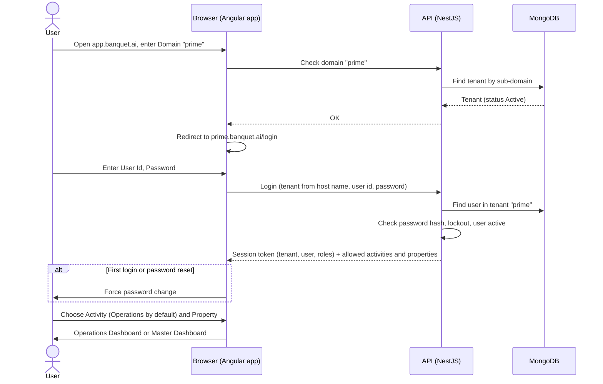

# Client Sign-up, Redirection and Login

Expands the **"Client Redirection and Login Logic"** section of the BanquetFlow requirements document.

What the original document says:

- After sign-up, a short **sub-domain** is reserved for the hotel or banquet group (e.g. `prime` for Hotel Prime Residency).
- Once the sub-domain is approved, a master user **`entp`** (hard-coded user id) is created with an **auto-generated password**.
- `entp` has access to everything (Master + Operations panels). Implementation engineers use it to set the client up.
- Login order: **Domain → User Id → Password → Activity** (Operations Dashboard or Master Dashboard), with **Operations as the default**.

Everything else below is marked **[Proposed default]** and needs confirming.

## 1. Terms

| Term | Meaning |
|---|---|
| **Tenant** | One client (hotel or banquet group). Owns one sub-domain and all its data. |
| **Sub-domain** | The tenant's short code, e.g. `prime`. Used in the URL `prime.banquet.ai` and typed as "Domain" on the login screen. |
| **Company / Property** | Inside a tenant: one or more companies, each with one or more properties (from Master Data). |
| **Activity** | Which panel the user opens after login: **Operations** (diary, reservations, billing) or **Master** (setup screens). |

## 2. Tenant lifecycle

```mermaid
stateDiagram-v2
    [*] --> PendingApproval : Client signs up, requests sub-domain
    PendingApproval --> Active : Banquet.ai approves; entp user created, credentials emailed
    PendingApproval --> Rejected : Sub-domain refused / duplicate / spam
    Active --> Suspended : Non-payment or on request (no logins)
    Suspended --> Active : Reinstated
    Active --> Terminated : Contract ends (data export, then purge after retention period)
    Suspended --> Terminated
    Rejected --> [*]
    Terminated --> [*]
```

### Sign-up

1. Client fills a sign-up form on `banquet.ai`: organisation name, contact name, email, mobile, requested sub-domain, number of properties.
2. **Sub-domain rules [Proposed default]:** 3 to 15 characters, lowercase letters and digits only (no spaces or hyphens), must start with a letter, unique across all tenants. Reserved words are refused: `www`, `app`, `api`, `admin`, `mail`, `support`, `help`, `status`, `docs`, `entp`.
3. The requested sub-domain is held (not usable by anyone else) while it is **Pending Approval**.
4. A Banquet.ai administrator approves it. The document says sub-domains are "approved", so this is a manual step for now.

### On approval

1. The tenant becomes **Active**.
2. The **`entp`** user is created inside the tenant with a random password (**[Proposed default]** 16 characters).
3. The credentials go to the client's contact email (and/or to the assigned implementation engineer), never shown on screen.
4. `prime.banquet.ai` starts working (wildcard DNS and SSL certificate cover every sub-domain, so nothing is set up per tenant).

## 3. Login flow

### How the user reaches the login screen

The document says users must "fill in" the domain each time. **[Proposed default]** support both ways:

- **Direct URL** `prime.banquet.ai`: the Domain field is pre-filled and locked.
- **Common URL** `app.banquet.ai` (and the mobile app): the user types the Domain. The system checks it and redirects the browser to `prime.banquet.ai`, remembering the last domain used on that device.

This is the "Client Redirection" in the document's heading.

### Steps

1. **Domain.** Must exist and be **Active**. Pending, Suspended and Terminated tenants show a clear message ("This account is suspended, contact your administrator") rather than a login form.
2. **User Id and Password.** User ids are unique **within a tenant**, so `entp` or `reception1` can exist in every tenant. User ids are case-insensitive; passwords are not.
3. **Error message** is the same whether the user id or the password is wrong ("Invalid user id or password"), so nobody can guess user ids.
4. **Activity.** Operations is pre-selected. A user only sees the activities their role allows: a receptionist might have Operations only, so the choice is skipped. `entp` sees both.
5. **Property [Proposed default].** If the user has access to more than one property, they pick one after login; it can be switched from the header without logging in again. One property means no prompt.

## 4. The `entp` user

| Rule | Proposed default |
|---|---|
| User id | Always `entp`; cannot be renamed or deleted |
| Access | Everything: Master and Operations, all companies and properties; its role cannot be edited |
| First login | Must change the auto-generated password |
| After go-live | The client's own admin can **disable** `entp` and re-enable it when an implementation engineer needs access again |
| Audit | Every action by `entp` is logged with who was using it if known (engineer name entered at login, optional) |
| Password reset | Only by the tenant's contact email or by Banquet.ai support, never by another tenant user |

**Open question:** Should implementation engineers share the `entp` password, or should each engineer get their own named user with an "Implementation" role? Named users are safer and give a proper audit trail. The `entp` user would then be a break-glass account.

## 5. Security rules

- **Tenant isolation.** Every record in the database carries the tenant id. The API takes the tenant from the host name (`prime.banquet.ai`) and checks it matches the tenant in the session token on every request. A user of `prime` can never read another tenant's data, even by changing an id in the URL.
- **Passwords** are stored only as a strong hash (bcrypt or argon2), never in plain text or in emails after the first one.
- **[Proposed default] Password policy:** at least 8 characters with letters and digits; cannot reuse the last 3.
- **[Proposed default] Lockout:** 5 wrong passwords in a row lock the user for 15 minutes. The tenant admin can unlock sooner.
- **[Proposed default] Session:** expires after 30 minutes of inactivity and at most 12 hours after login. A user can be logged in on more than one device.
- **Forgot password:** emails a one-time reset link valid for 30 minutes to the user's registered email.
- **Role check on every screen and API**, not just by hiding menu items in the browser.
- **Login audit:** every successful and failed login is recorded with time, IP address and device.

## 6. Open questions

1. Is sub-domain approval manual (a Banquet.ai admin approves) or automatic once payment is made?
2. Shared `entp` versus named implementation users (see section 4).
3. Do clients need two-factor authentication (OTP on mobile or email), at least for Master access?
4. Should a user be limited to one active session at a time?
5. Can a tenant use its own domain (e.g. `banquets.primeresidency.com`) instead of a `banquet.ai` sub-domain?
