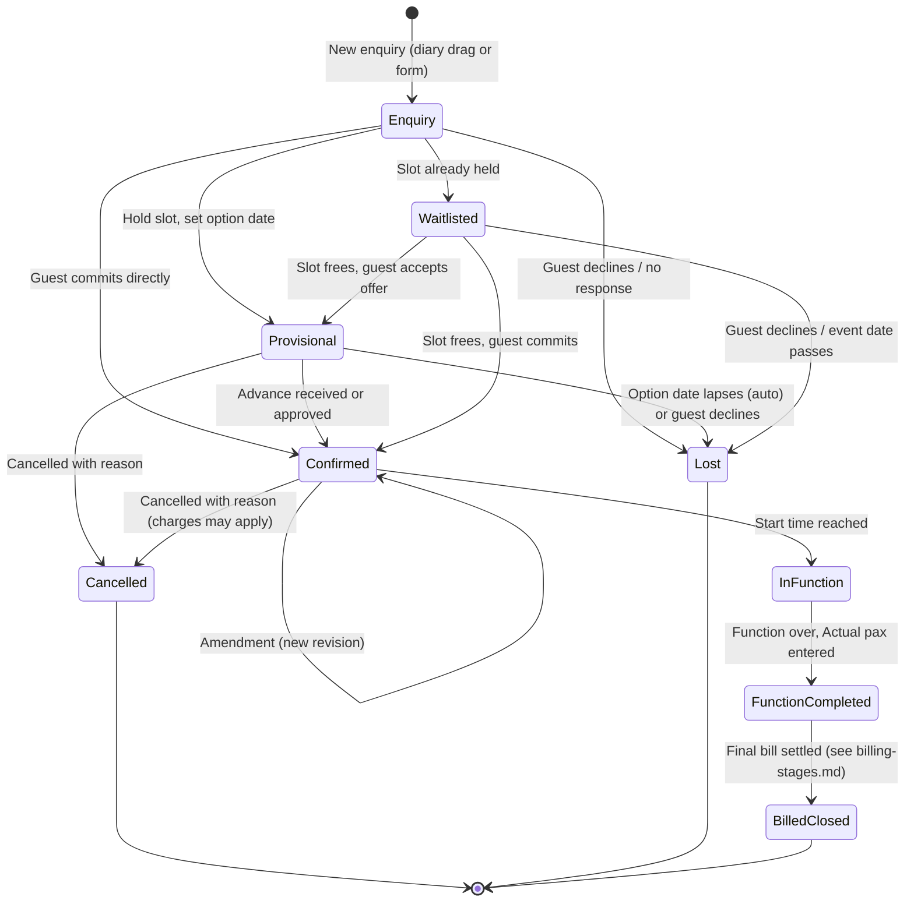

# Banquet Reservation Stages

Fills the empty **"Banquet Reservation Stages"** section of the BanquetFlow requirements document.

Items marked **[Proposed default]** are not in the original document. They are reasonable starting points that should be confirmed or changed. Each one should be a per-property setting (see [open-questions.md](open-questions.md#proposed-master-settings)), not a hard-coded rule.

## 1. Statuses

The document names four statuses for a booking (Confirmed, Provisional, Waitlisted, Enquiry) and the diary legend adds Cancelled and Area Block. This spec uses the following set.

| Status | Diary colour (from mock-up) | Holds the hall? | Meaning |
|---|---|---|---|
| **Enquiry** | Lavender | No | A guest has asked about a date, hall or menu. Nothing is held. Several enquiries can sit on the same slot. |
| **Provisional** | Green | Yes, until the option date | The slot is held for this guest while they decide. Other guests can only be waitlisted behind it. |
| **Waitlisted** | Orange | No (queued) | The guest wants a slot that is already Provisional or Confirmed for someone else. Kept in a queue in case it frees up. |
| **Confirmed** | Blue | Yes | The guest has committed (advance paid or approved without one). |
| **In Function** | Blue | Yes | **[Proposed]** The event is taking place now. Set automatically at start time, or manually by the banquet captain. |
| **Function Completed** | Blue (with a "completed" marker) | No longer relevant | **[Proposed]** The event is over. Actual pax must be entered; billing starts. |
| **Billed / Closed** | Blue (with a "billed" marker) | — | **[Proposed]** The final bill is settled. The reservation is read-only. |
| **Cancelled** | Olive / khaki | No | Cancelled by the guest or the hotel, with a Cancellation Reason. The slot is released. |
| **Lost** | Hidden by default | No | **[Proposed]** An Enquiry or Provisional that never converted (guest chose elsewhere, option lapsed). Kept for conversion reports. |

**Area Block** (dark grey) is **not** a reservation status. It is a separate record (hall, from–to, Hall Block Reason such as "Maintenance: Fumigation") that blocks the hall for everyone. It cannot be created over a Provisional or Confirmed booking without first moving or cancelling that booking.

## 2. State diagram

## 3. Stage by stage

### 3.1 Enquiry

- **Created from:** the Reservation Diary (drag across empty or occupied cells, then fill the popup), or an enquiry form. Later, the AI bot could create enquiries too.
- **Mandatory:** guest / company name, contact number, function date, from–to time, function type, **Guaranteed pax** and **Expected Max pax** (the document says Min and Max Pax are mandatory "in all the cases"; see [guest-count-rules.md](guest-count-rules.md)).
- **Optional:** hall (an enquiry may not have picked one yet), seating style, package of interest, notes, source (walk-in, phone, email, web).
- **Does not hold the slot.** Any number of enquiries can overlap.
- **[Proposed default]** A follow-up date is set; overdue follow-ups appear in the diary's "Reminders / Live Updates" box.

### 3.2 Provisional

- **Additional mandatory fields:** hall and exact time slot, **option date** (the date by which the guest must confirm).
- **Availability check:** the hall must be free of any other Provisional, Confirmed or In Function booking and of any Area Block for the requested time (plus the setup / cleanup buffer, see below).
- **Capacity check:** Guaranteed pax must not exceed the hall's Capacity (covers). Expected Max above capacity is a warning, not a block.
- **[Proposed default]** Option date defaults to 7 days from today, and never later than the function date minus 3 days.
- **[Proposed default]** When the option date passes without confirmation, the system sends a reminder on the day and then moves the booking to **Lost** at end of day, releasing the slot. The first waitlisted guest for that slot is flagged for a call.

### 3.3 Waitlisted

- Created when a guest wants a slot that another guest already holds.
- Waitlist order is first-come, first-served per hall and slot.
- When the slot frees (the holder cancels or lapses), the system **notifies** the reservations team about the first waitlisted booking. It does **not** auto-promote, because the guest must be called and must still want the date.

### 3.4 Confirmed

- **Trigger:** advance received (see [open-questions.md](open-questions.md#1-advances-and-deposits)), or a user with the right role confirms without an advance and gives a reason.
- **What it unlocks:**
  - Menu finalisation for each package (pick within the package's min / max per sub-group).
  - Services (dance floor, projector, décor) with vendor and quantity.
  - Billing Instructions (from the master list).
  - The **Function Prospectus / Event Order** print for kitchen, service and housekeeping.
  - A **Proforma bill** (see [billing-stages.md](billing-stages.md#stage-1--proforma-estimate)).
- **[Proposed default] Guarantee cut-off:** 72 hours before function start. After the cut-off, Guaranteed pax can only go **up**, not down, and the menu is frozen (changes need a manager role).

### 3.5 Amendment (on Provisional or Confirmed)

An amendment is **not** a separate status. Any change to date, time, hall, pax, menu, services or rates on a Provisional or Confirmed booking:

1. Requires an **Amendment Reason** (from the master).
2. Creates a new **revision** of the reservation. Previous revisions are kept read-only, with who changed what and when.
3. Re-runs the availability and capacity checks if date, time, hall or pax changed.
4. Regenerates the proforma and re-checks the required advance.
5. Re-prints the Event Order with an "AMENDED" marker and revision number.

See [open-questions.md](open-questions.md#3-amendments) for amendments after the guarantee cut-off.

### 3.6 Cancellation

- Allowed from Enquiry, Provisional, Waitlisted or Confirmed. Requires a **Cancellation Reason**.
- Enquiries and lapsed Provisionals usually go to **Lost** rather than Cancelled, so reports can tell "never converted" apart from "converted then cancelled".
- Cancelling a Confirmed booking may produce a cancellation charge and a refund of the remaining advance. See [open-questions.md](open-questions.md#2-cancellation-charges).
- The slot is released immediately and the waitlist is notified.

### 3.7 In Function and Function Completed

- **In Function** is set automatically at the start time (or manually by the banquet captain). From here, ala-carte orders and extra services post to the reservation's running bill.
- **Function Completed** is set when the event ends. The user must enter **Actual pax** before the booking can move to billing.
- **[Proposed default]** If Actual pax is not entered within 24 hours of the end time, it shows as overdue in the Reminders box.

### 3.8 Billed / Closed

Reached when the final bill is settled in full (see [billing-stages.md](billing-stages.md)). The reservation and all its revisions become read-only.

## 4. Rules that apply across stages

- **Overlap rule:** for one hall and one moment in time, at most one booking in Provisional, Confirmed or In Function, and no Area Block. Enquiry and Waitlisted never block.
- **[Proposed default] Setup / cleanup buffer:** 0 minutes by default, configurable per hall (for example 60 minutes between a lunch and a dinner in the same hall).
- **Bookings store exact start and end times** (for example 12:30–16:25, as in the mock-up). The diary's hourly rows are only a display grid.
- **Multi-hall and multi-day events:** one reservation can hold several halls and/or several days. Each hall-and-time line is checked for overlap separately.
- **Who can do what** is set per role in Roles Setup. Suggested permissions: create enquiry, hold provisional, confirm, confirm without advance, amend after cut-off, cancel confirmed, override capacity.
- **Audit:** every status change records user, time and reason.
